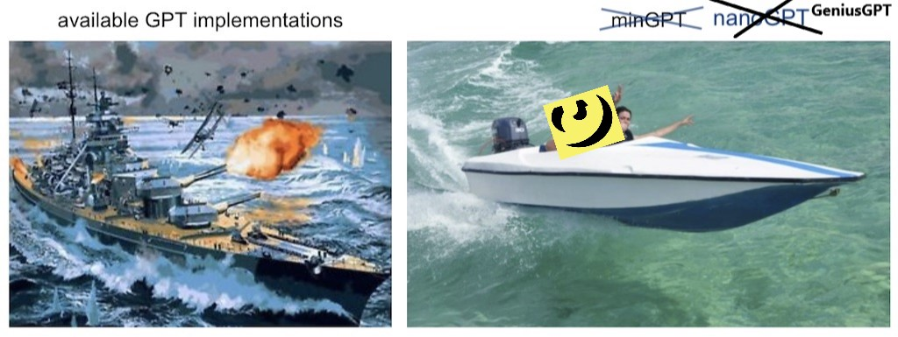
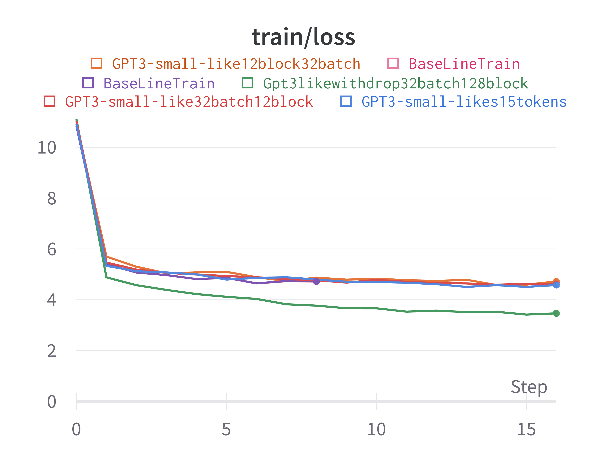
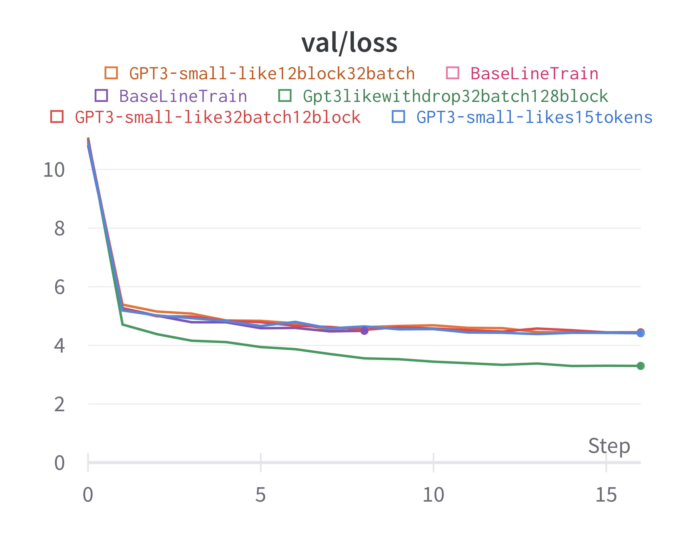

# nanoGPT




Welcome to our Data309 project on training a GPT model on pop lyrics data. This project uses [nanoGPT](https://github.com/karpathy/nanoGPT) writen by [Andrej karpathy](https://github.com/karpathy) and slighted edited by us for our project.


## install

```
pip install torch numpy transformers datasets tiktoken wandb tqdm nltk
```

Dependencies:

- [pytorch](https://pytorch.org) <3
- [numpy](https://numpy.org/install/) <3
-  `transformers` for huggingface transformers <3 (to load GPT-2 checkpoints)
-  `datasets` for huggingface datasets <3 (if you want to download + preprocess OpenWebText)
-  `tiktoken` for OpenAI's fast BPE code <3
-  `wandb` for optional logging <3
-  `tqdm` for progress bars <3

You will also need to do the following:
 - Clone (or download) This repo
 - You will also need to download the dataset [Lyrics](https://www.kaggle.com/datasets/carlosgdcj/genius-song-lyrics-with-language-information) and unzip (warning it is quite large ~9GB)

## start

To get started you will have to run the `Create_Genres.py` script on the csv downloaded from kaggle. The scipt expects the file to be in the same directory feel free to edit the python file and change the source file location yourself.
This script will create two text files `TrainingSet.txt` and `ReferenceSet.txt` and prints the number of songs in those files. 

The next step is to copy and paste the `TrainingSet.txt` file into the `lyrics` folder which is located in `nanoGPT-master` > `data` > `lyrics`, once this is done run the `prepare.py` file to create `train.bin` and `val.bin` which is required for training and validation of the model. This may also take a couple minutes to run given the large size of the `TrainingSet.txt`.

Once that has run we can then start training and view some output.

**Baselinetrain** 

"Baselinetrain" is the name given to our starting point configuration for the project, given by Andrej karpathy. This does not require a GPU and can run in a reasonable time on a laptop machine. This file is stored in `nanoGPT-master` > `config`.
Open a terminal inside the `nanoGPT-master` folder and enter the following

python train.py config/baselinetrain.py --device=cpu --compile=False 

This should hopefully start training a model using the lyrics dataset provided earlier, once this has finished running we can then look at some samples of lyrics.
In the terminal run the following code:
`python sample.py --device='cpu' --compile=False`
This should then print out 10 samples of song lyrics from the model.


**Other configurations**

If you have a reasonable powerful system and have the ability to use pytorch's compile flag then you can run any of the other configurations in the `config` folder.
As mentioned in our report the `gpt3-small-like-withdrop32b128b` config performed the best. It took ~13 minutes to run on our VM using 4x Quadro RTX 6000 GPUs. 


## Evaluation

To evaluate the model you can use your eyes, but we can also look at the training/validation loss of the model although this is not a foolproof method of gaining the best lyric samples as some of them are just bad.



This gives us a rough idea of which configurations may be the most promising.

In our project we also used [BLEU](https://en.wikipedia.org/wiki/BLEU) to gain another metric for how good a set of samples from a configuration might be.


**How to evaluate some samples
 
 It would be helpful to save the sample output to a file first, do this by running the following code:
  `python sample.py --device='cpu' --compile=False > lyric_samples.txt`
Then move that file to the home directory (the same place that `splitsamples.py` is located) and run the file. 
This will make a new folder called `samples` where each file is a sample from the model trained before (You can delete `sample11.txt` as it is empty)

You can then run the `bleu_parallel.py` which prints the average score, then the scores where each element of the list is the bleu score from each line of the candidate set (this was used to generate a sampling distribution of the bleu scores for a particular configuration), then finally the time taken to run.

The density_and_plot R code was used to make the distribution.


## More information

For additional notes on the project refer to the project report.